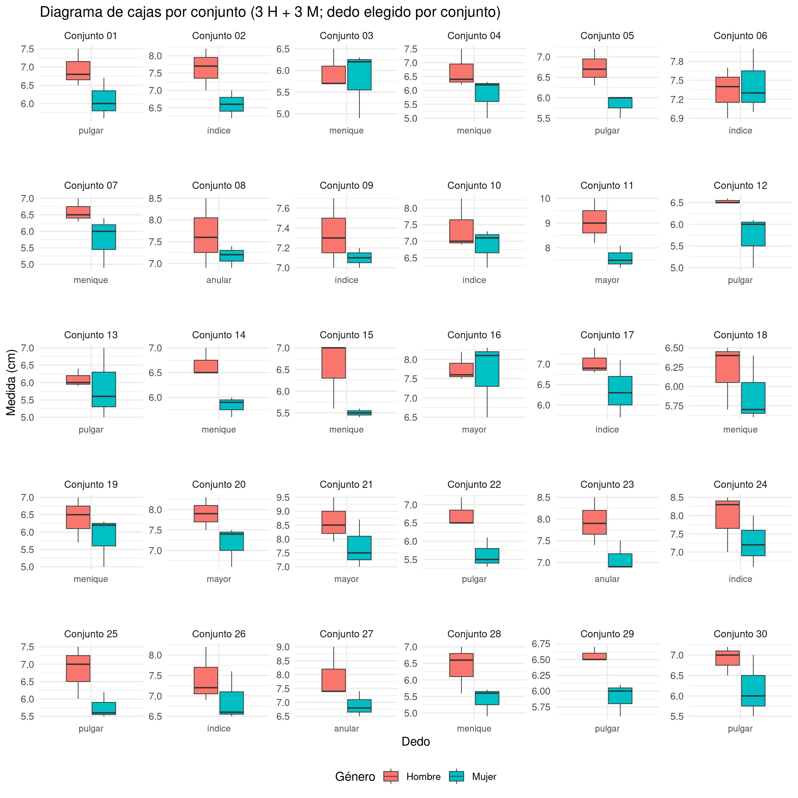

```{r setup, include=FALSE}
knitr::opts_chunk$set(
  echo = TRUE,
  warning = FALSE,
  message = FALSE,
  out.width = '100%',
  fig.retina = 4,
  cache = FALSE)
```

```{r, include=F}
output_format <- knitr::opts_knit$get("rmarkdown.pandoc.to")
repo_url <- system("git config --get remote.origin.url", intern = TRUE)
repo_name <- sub(".git$", "", basename(repo_url))
org_name <- basename(dirname(repo_url))
rmd_filename <- tools::file_path_sans_ext(basename(knitr::current_input()))
github_pages_url <- paste0("https://", org_name, ".github.io/", repo_name, "/", rmd_filename, ".html")
```

```{r, results='asis', echo=F}
if (grepl('gfm', output_format)) {
  cat('Versión HTML (quizá más legible), [aquí](', github_pages_url, ')\n', sep = '')
} else if (output_format == 'latex') {
  cat('Versión HTML (quizá más legible), [aquí](', github_pages_url, ')\n', sep = '')
}
```

# Fecha/hora de entrega

**Ver portal de la asignatura**

# Justificación

Aprender a aplicar pruebas estadísticas en biogeografía es crucial porque permite analizar datos espaciales y ecológicos complejos, tomar decisiones basadas en evidencia, y evaluar hipótesis sobre la distribución de la biodiversidad. Las técnicas estadísticas ayudan a manejar la variabilidad natural, comparar grupos y regiones, y desarrollar modelos predictivos que son esenciales para la planificación y conservación. Además, garantizan la solidez de los resultados en publicaciones científicas, asegurando que los estudios sean rigurosos y reproducibles.

Con el advenimiento del machine learning, deep learning e inteligencia artificial, la biogeografía ha experimentado avances significativos, permitiendo la construcción de modelos predictivos más precisos, la automatización del análisis de grandes volúmenes de datos espaciales, y la identificación de patrones complejos en la distribución de especies. Sin embargo, la estadística sigue siendo fundamental para validar estos modelos, interpretar resultados de manera rigurosa y garantizar la reproducibilidad científica, sobre todo cuando lo que tenemos a mano son muestras pequeñas, algo que en biología es muy común, sobre todo en estudios de campo. Mientras que la IA ofrece nuevas herramientas poderosas, las pruebas estadísticas siguen siendo esenciales para fundamentar hipótesis, comparar estudios y proporcionar un marco de referencia sólido en la investigación biogeográfica. Ya no hablemos de la modelización en presencia de mediciones repetidas, donde no se satisfacen varios de los supuestos de las técnicas tradicionales, relevando el papel de técnicas de modelización robustas muy usadas en ecología (e.g. modelos de efecto mixto). Como digo, la muestra pequeña sigue siendo predominante en ecología y biogeografía, y la estadística ha demostrado ser muy robusta en estos casos.

# Ejercicio 1: Comparación de las medidas de los dedos entre dos estudiantes usando la prueba t de Student para muestras emparejadas

## Objetivo

Aplicar la prueba t de Student para muestras pareadas (también conocida como prueba t para muestras relacionadas o emparejadas), comparando las medidas de los dedos de un estudiante (Muestra 1) con las medidas de los dedos de otro estudiante (Muestra 2).

Este ejercicio te permitirá determinar si hay diferencias significativas entre las medidas de los dedos de dos personas diferentes. Para mantenerlo simple, no haremos comprobación de supuestos, sólo aplicaremos la prueba. La comprobación de supuestos la abordaremos en otra práctica.

Es importante que, cuando termines esta práctica, estudies sobre los procedimientos usados (ve al Drive de libros que se encuentra como mensaje destacado en el foro). Por ejemplo, interésate por saber por qué en cada caso se usa una fórmula específica, o qué criterios se usan para interpretar el resultado final. Esto lo podrás encontrar en cualquier libro de estadística, pero te recomiendo que uses a Triola (2012). Igualmente, documéntate sobre la significancia como concepto y sobre la crisis que existe actualmente en su aplicación. [Este artículo](https://www.jvsmedicscorner.com/Statistics_files/Retire%20statistical%20significance.pdf) de opinión, de Amrhein y otros (2019), puede ser un buen punto de partida (hay "pila" de artículos sobre este tema, que conste). Documéntate también sobre conceptos como "tamaño del efecto" y "diseño experimental", para lo cual te recomiendo [este trabajo de Frank y otros (2021)](https://australianprescriber.tg.org.au/articles/is-it-time-to-stop-using-statistical-significance.html).

## Planteamiento del Problema

Se cuenta con las medidas de los cinco dedos de una mano de varios estudiantes, cuyos nombres reales han sido anonimizados mediante pseudónimos, para lo cual se usó el paquete `charlatan` (no 'toy relajando, ke conste, puedes verlo en un código oculto dentro de la versión RMarkdown de este archivo `README.Rmd`). Las medidas se registraron en un formulario que almacenaba los datos en una hoja de cálculo (archivo `biometria-basica.csv`). Para los fines de este ejercicio, se crearon 30 conjuntos de datos al azar, donde se señalan "Muestra_1" y "Muestra_2". Debes elegir uno de los 30 conjuntos, asegurándote de no duplicar con otro/a compañero/a.

```{r, echo=F, eval=F}
## Sólo para fines de registro/archivo
# Generación de pseudónimos para datos de biometría básica de semestres anteriores 
library(charlatan)
set.seed(20250909)

# 37 nombres en español (México, porque no hay locale es_DO)
n <- 37
pseudonimos <- ch_name(n, locale = "es_MX")
pseudonimos
```


Para las dos muestras de tu conjunto, compararás las medidas de los cinco dedos, de forma pareada. En este caso, "pareada" significa, que harás una comparación considerando el dedo medido, es decir, pulgar-a-pulgar, índice-a-índice, y así. La comparación se realiza utilizando la prueba t de Student pareada para determinar si hay diferencias significativas entre las medidas de los dedos de dos estudiantes (o muestras, en este caso, "Muestra_1" y "Muestra_2").

## Recolección de Datos

1. **Creación de los conjuntos**: Se han creado conjuntos de pares de estudiantes al azar utilizando pseudónimos con el siguiente código de R (en la versión HTML de este cuaderno, si no ves el código, presiona el botón `Show`). Cada conjunto se compone de dos muestras, "Muestra_1" y "Muestra_2", que representan las medidas de los dedos de dos estudiantes diferentes.


```{r}
n_conjuntos <- 30
# Cargar los datos
data <- read.csv("biometria-basica.csv", check.names = F)
# Quitar los NA
data <- data[!sapply(1:nrow(data), function(x) any(is.na(unlist(data[x, 4:8, drop=T])))), ]
# Cambiar nombres de columnas
colnames(data) <- gsub("\\..*|\\(.*", "", colnames(data))

# Combinaciones
combinaciones <- t(combn(trimws(data[, grep('^pseudonimo', colnames(data))]), 2))
set.seed(999) # Fijar la semilla para reproducibilidad
seleccion <- combinaciones[
  sample(1:nrow(combinaciones),
         n_conjuntos, replace = F), ]

# Crear la tabla con 30 conjuntos a partir de pseudónimos de estudiantes
conjuntos_par <- data.frame(
  Conjunto = paste("Conjunto", 1:n_conjuntos),
  Muestra_1 = seleccion[,1],
  Muestra_2 = seleccion[,2]
)
```

```{r}
knitr::kable(conjuntos_par)
```


2. **Obtención de las medidas de los dedos**: Las medidas de los cinco dedos de la mano de cada estudiante están registradas en la hoja de cálculo proporcionada, la cual transcribo abajo. También encuentra en este mismo repo (archivo `biometria-basica.csv`).

```{r}
# Mostrar la tabla generada
knitr::kable(data)
```

3. **Mandato**. __Elige un conjunto e, IMPORTANTE MUY IMPORTANTE, anúncialo en el foro dentro del hilo correspondiente. Si alguien más lo elige antes que tú, deberás cambiarlo__. Aplica la prueba t de Student para muestras pareadas de un conjunto elegido por ti, comparando las medidas de los dedos de un estudiante (Muestra 1) con las medidas de los dedos de otro estudiante (Muestra 2) para determinar si hay diferencias significativas entre las medidas de los dedos de dos personas diferentes; usa un nivel de significancia de 0.05. Interpreta y/o resume los resultados con un pequeño párrafo que explique si las diferencias encontradas son estadísticamente significativas y qué implicaciones podrían tener en el contexto del estudio. Mira el ejemplo a continuación para guiarte sobre cómo proceder.

## Ejemplo de aplicación de la prueba t de Student para muestras pareadas

### Fórmula de la prueba t para muestras pareadas

La prueba t de Student para muestras pareadas se utiliza para comparar las medias de dos conjuntos de datos emparejados por medio de algún atributo común, en este caso, "dedos de la mano". La fórmula es la siguiente:

$$
t = \frac{\bar{D}}{s_D / \sqrt{n}}
$$

Donde:

- $\bar{D}$ es la media de las diferencias entre las medidas emparejadas.
- $s_D$ es la desviación estándar de las diferencias.
- $n$ es el número de pares de datos (en este caso, 5).

### Ejemplo Práctico

Supongamos que tienes los siguientes datos de medidas de los dedos para un par de estudiantes (Muestra 1 y Muestra 2):

| Dedo        | Muestra 1 (cm) | Muestra 2 (cm) |
|:-------------:|:----------------:|:----------------:|
| Pulgar      | 6.5            | 6.3            |
| Índice      | 7.2            | 7.0            |
| Mayor       | 7.8            | 7.7            |
| Anular      | 7.4            | 7.2            |
| Meñique     | 5.9            | 5.8            |

1. **Calcular las diferencias $D_i$ entre las medidas de la Muestra 1 y la Muestra 2, donde $i$ representa cada dedo**:

$$
D = \text{Muestra 1} - \text{Muestra 2}
$$

| Dedo        | Muestra 1 (cm) | Muestra 2 (cm) | $D_i$ |
|:-------------:|:-------------:|:-------------:|:-------------:|
| Pulgar      | 6.5            | 6.3            | 0.2   |
| Índice      | 7.2            | 7.0            | 0.2   |
| Mayor       | 7.8            | 7.7            | 0.1   |
| Anular      | 7.4            | 7.2            | 0.2   |
| Meñique     | 5.9            | 5.8            | 0.1   |

> Nota: si obtuvieses diferencias negativas, deberás respetar el signo en las operaciones subsiguientes. Eso sí, recuerda que al elevar al cuadrado una cantidad negativa, obtendrás como resultado una cantidad positiva.

2. **Calcular la media de las diferencias $\bar{D}$**:

$$
\bar{D} = \frac{\sum D_i}{n} = \frac{0.2 + 0.2 + 0.1 + 0.2 + 0.1}{5} = \frac{0.8}{5} = 0.16
$$

3. **Calcular la desviación estándar de las diferencias $s_D$**:

Primero, calculamos $D_i - \bar{D}$ para cada diferencia y elevamos al cuadrado:

| Dedo        | $D_i$ | $D_i - \bar{D}$ | $(D_i - \bar{D})^2$ |
|:-------------:|:-------------:|:-------------:|:-------------:|
| Pulgar      | 0.2   | 0.04     | 0.0016       |
| Índice      | 0.2   | 0.04     | 0.0016       |
| Mayor       | 0.1   | -0.06    | 0.0036       |
| Anular      | 0.2   | 0.04     | 0.0016       |
| Meñique     | 0.1   | -0.06    | 0.0036       |

Luego, sumamos todos los $(D_i - \bar{D})^2$ y calculamos $s_D$:

$$
s_D = \sqrt{\frac{\sum (D_i - \bar{D})^2}{n - 1}} = \sqrt{\frac{0.0016 + 0.0016 + 0.0036 + 0.0016 + 0.0036}{5 - 1}} = \sqrt{\frac{0.012}{4}} = \sqrt{0.003} \approx 0.055
$$

4. **Calcular la estadística t** (también conocido como "estadístico de prueba"):

$$
t = \frac{\bar{D}}{s_D / \sqrt{n}} = \frac{0.16}{0.055 / \sqrt{5}} = \frac{0.16}{0.0246} \approx 6.50
$$

5. **Grados de libertad**:

$$
df = n - 1 = 5 - 1 = 4
$$

6. **Determinación del valor crítico:**

Para un nivel de significancia $\alpha$ de 0.05 y 4 grados de libertad, el valor crítico de $t$ en una prueba de dos colas es aproximadamente ±2.776 (lo puedes obtener en R con el código `qt(p = 0.025, df = 4)` y `qt(p = 0.975, df = 4)`, pero también lo puedes buscar en tablas estadísticas de libros tipo manuales que podrás ver en el Drive de libros). Esto significa que si el valor del estadístico de prueba obtenido es mayor que +2.776, o menor que -2.776, podemos rechazar la hipótesis nula de igualdad de medias. En caso contrario, no podemos rechazar la hipótesis nula de igualdad (o mejor, "homogeneidad") de medias. Si lo hiciéramos a través del valor $P$, rechazaríamos la hipótesis nula si el valor $P$ fuese menor que $\alpha$ (que en nuestro caso, elegimos 0.05), y no rechazaríamos la hipótesis nula si el valor $P$ fuese mayor que $\alpha$.

7. **Conclusión:**

Dado que el valor calculado de $t$ (+6.50) es mayor que el valor crítico de $t$ por la derecha (+2.776), podemos rechazar la hipótesis nula. Esto significa que hay una diferencia significativa entre las medidas de los dedos de los dos estudiantes en este ejemplo.

Este cálculo demuestra que, a pesar del tamaño de muestra pequeño, se detectó una diferencia significativa entre las dos muestras en este caso particular. Sin embargo, con tamaños de muestra tan pequeños, y sin haber realizado verificación de supuestos, los resultados deben interpretarse con cautela, ya que el poder estadístico es limitado.

### ¿Cómo se haría en R?

```{r, eval = F, echo = T}
# Ejemplo en R
muestra_1 <- c(6.5, 7.2, 7.8, 7.4, 5.9)
muestra_2 <- c(6.3, 7.0, 7.7, 7.2, 5.8)
t.test(muestra_1, muestra_2, paired = TRUE)
```

---

# Ejercicio 2: Comparación de medidas de dedos entre géneros usando la prueba t de Student para muestras independientes

## Objetivo

El objetivo de este ejercicio es aplicar la prueba t de Student para muestras independientes, comparando las medidas de los dedos entre géneros (hombre y mujer). Se busca determinar si existe una diferencia significativa entre las medidas de los dedos de hombres y mujeres.

Para mantener el ejercicio simple, usaremos muestras balanceadas, es decir, cada muestra será pequeña, y tendrá el mismo número de elementos; serán tres mediciones de hombres, tres mediciones de mujeres. Esto no implica que no pueda aplicarse la prueba t de Student con muestras desbalanceadas (por ejemplo, 5 hombres y 8 mujeres, pero hay un límite en el desbalance), sólo que para fines de cálculos manuales, es más sencillo de esta forma. Es importante tener en cuenta que, con tamaños de muestras tan pequeños, el poder estadístico de la prueba se reduce mucho, pero al menos para un ejercicio de aula como éste, simplificamos mucho en cálculos.

Por otro lado, al igual que en el ejercicio anterior, nos saltaremos la comprobación de supuestos para mantener el ejercicio lo más simple posible, y lo abordaremos en otra práctica.

## Planteamiento del Problema

Elegirás un conjunto de datos, asegurándote de no duplicar con otro/a compañero/a. A diferencia del ejercicio anterior, en este las muestras no son pareadas, por lo que la comparación no será vis a vis. Aclarar además que los conjuntos de este ejercicio son distintos a los del anterior. Cada conjunto, se compone de dos muestras independientes. La muestra 1 contiene las mediciones de un mismo dedo de tres personas del género mujer elegidas al azar. La muestra 2 se construye igualmente, es decir, a partir de las mediciones del mismo dedo, pero de tres personas del género hombre. Se aplicará la prueba t de Student para muestras independientes, con la que podremos determinar si hay diferencias significativas entre las medidas del dedo elegido entre géneros.

## Recolección de Datos

1. **Selección de individuos**: La tabla a continuación muestra combinaciones de tres hombres y combinaciones de tres mujeres elegidas al azar, así como un dedo de la mano, también elegido al azar.

- Código con el que se generó el conjuntos de datos.

```{r}
# Selección de hombres y mujeres
hombres <- trimws(data[data$genero == "Hombre", "pseudonimo"])
mujeres <- trimws(data[data$genero == "Mujer", "pseudonimo"])

# Crea la tabla de conjuntos
set.seed(123) # Fija la semilla para reproducibilidad
conjuntos_ind <- data.frame(
  Conjunto = 1:n_conjuntos,
  Hombres_elegidos = replicate(n_conjuntos, paste(sample(hombres, 3, replace = FALSE), collapse = ", ")),
  Mujeres_elegidas = replicate(n_conjuntos, paste(sample(mujeres, 3, replace = FALSE), collapse = ", ")),
  Dedo_elegido = replicate(n_conjuntos, sample(colnames(data)[4:8], 1))
)
```

Debes elegir un conjunto, anunciarlo en el hilo correspondiente en el foro, y tomar nota de los nombres de personas que te tocan y el dedo "elegido" (columna `Dedo elegido`) en la tabla siguiente.

```{r}
knitr::kable(conjuntos_ind)
```

2. **Obtención de las medidas de los dedos**: Las medidas del dedo elegido de tu conjunto están registradas en la hoja de cálculo proporcionada, la cual transcribo abajo. También se encuentra en este mismo repo, archivo `biometria-basica.csv`.

```{r}
# Mostrar la tabla generada
knitr::kable(data)
```

3. **Mandato**. __Elige un conjunto e, IMPORTANTE MUY IMPORTANTE, anúncialo en el foro dentro del hilo correspondiente. Si alguien más lo elige antes que tú, deberás cambiarlo__. Aplica la prueba t de Student para muestras independientes, comparando las medidas del dedo entre géneros de tu conjunto elegido, para determinar si existe diferencia significativa entre las medidas entre hombres y mujeres. Interpreta y/o resume los resultados con un pequeño párrafo que explique si las diferencias encontradas son estadísticamente significativas y qué implicaciones podrían tener en el contexto del estudio. Además, considera mirar, como referencia, los diagramas de cajas siguientes.

- Todos los dedos de todas las personas, según género.

```{r}
# Diagrama de cajas para todas las medidas de los dedos por género
library(ggplot2)
data_long <- reshape2::melt(
  data,
  id.vars = c("pseudonimo", "genero"),
  measure.vars = colnames(data)[4:8],
  variable.name = "Dedo", value.name = "Medida")
ggplot(data_long, aes(x = Dedo, y = Medida, fill = genero)) +
  geom_boxplot() +
  labs(title = "Diagrama de cajas de medidas de dedos por género",
       x = "Dedo",
       y = "Medida (cm)",
       fill = "Género") +
  theme_minimal()
```

- El dedo elegido de cada conjunto:

```{r, fig.height=10}
# Paquetes
library(dplyr)
library(tidyr)
library(stringr)
library(purrr)
library(ggplot2)

# Asegura que los nombres coincidan exactamente (espacios)
data <- data %>% mutate(pseudonimo = trimws(pseudonimo))

# Función auxiliar para dividir "A, B, C" -> c("A","B","C")
split_trim <- function(x) trimws(unlist(str_split(x, ",")))

# Construir el dataset para los 30 paneles:
# - Para cada Conjunto: tomar sus 3 H + 3 M, pivotear dedos (cols 4:8),
#   filtrar por el Dedo_elegido de ese conjunto.
panel_df <- conjuntos_ind %>%
  mutate(
    hombres_sel = map(Hombres_elegidos, split_trim),
    mujeres_sel = map(Mujeres_elegidas, split_trim),
    seleccion   = map2(hombres_sel, mujeres_sel, ~c(.x, .y))
  ) %>%
  select(Conjunto, Dedo_elegido, seleccion) %>%
  pmap_dfr(function(Conjunto, Dedo_elegido, seleccion) {
    data %>%
      filter(pseudonimo %in% seleccion) %>%      # 6 personas
      mutate(Conjunto = Conjunto) %>%
      pivot_longer(cols = 4:8, names_to = "Dedo", values_to = "Medida") %>%
      filter(Dedo == Dedo_elegido)               # solo el dedo de ese conjunto
  }) %>%
  mutate(
    genero = factor(genero, levels = c("Hombre","Mujer")),
    facet  = sprintf("Conjunto %02d", as.integer(Conjunto))
  )
# Diagrama de cajas para todas las medidas de los dedos por género y conjunto
p <- ggplot(panel_df,
       aes(x = Dedo, y = Medida, fill = genero,
           group = interaction(Dedo, genero))) +
  geom_boxplot(position = position_dodge(width = 0.6),
               width = 0.55, outlier.shape = 16, outlier.alpha = 0.6,
               linewidth = 0.3) +
  facet_wrap(~ facet, nrow = 5, ncol = 6, scales = "free") +
  scale_x_discrete(drop = TRUE) +
  labs(title = "Diagrama de cajas por conjunto (3 H + 3 M; dedo elegido por conjunto)",
       x = "Dedo", y = "Medida (cm)", fill = "Género") +
  theme_minimal() +
  theme(
    strip.text = element_text(size = 9),
    axis.text.x = element_text(size = 8),
    legend.position = "bottom"
  ) +
  theme(panel.spacing.y = grid::unit(2.5, "lines"))
# Exportar
jpeg('img/diagrama_cajas_cada_conjunto.jpg', width=3000, height=3000, res=300)
p
invisible(dev.off())
```




Se supone que el diagrama de caja y la prueba estadística, deben ser consistentes entre sí (una prueba con resultado significativo debería ser consistente con un diagrama de cajas con efecto). No obstante, ten presente que los diagramas de caja analizan la totalidad de los y las participantes, mientras que tú solamente estás analizando seis elementos (tres hombres y tres mujeres).

Como comenté arriba, usarás muestras balanceadas, es decir, tres hombres y tres mujeres para realizar la comparación. Ten en cuenta que, con tamaños de muestras tan pequeños, el poder estadístico de la prueba es limitado, y esto deberías destacarlo en tu redacción.

## Aplicación de la Prueba t de Student para Muestras Independientes

### Fórmula de la prueba t para muestras independientes

La prueba t de Student para muestras independientes se utiliza para comparar las medias de dos grupos no relacionados. La fórmula es:

$$
t = \frac{\bar{X}_1 - \bar{X}_2}{\sqrt{\frac{s_1^2}{n_1} + \frac{s_2^2}{n_2}}}
$$

Donde:

- $\bar{X}_1$ y $\bar{X}_2$ son las medias de los dos grupos.
- $s_1^2$ y $s_2^2$ son las varianzas de los grupos.
- $n_1$ y $n_2$ son los tamaños de muestra de los dos grupos (en este caso, cada grupo tiene 3 elementos u observaciones).

La media de cada grupo se calcula utilizando la siguiente fórmula:

$$
\bar{X} = \frac{\sum_{i=1}^{n} X_i}{n}
$$


La varianza de cada grupo se calcula usando la siguiente fórmula:

$$
s^2 = \frac{\sum_{i=1}^{n}(X_i - \bar{X})^2}{n - 1}
$$


### Ejemplo Práctico

Supongamos que tenemos las siguientes medidas para un dedo específico (e.g., índice):

| Género  | Índice |
|:---------:|:--------------:|
| Hombre  | 7.4          |
| Hombre  | 7.1          |
| Hombre  | 7.3          |
| Mujer   | 6.8          |
| Mujer   | 6.7          |
| Mujer   | 6.9          |

1. **Calcular las medias de los dos grupos $\bar{X}_1$ y $\bar{X}_2$:**

$$
\bar{X}_1 = \frac{7.4 + 7.1 + 7.3}{3} = \frac{21.8}{3} = 7.27
$$

$$
\bar{X}_2 = \frac{6.8 + 6.7 + 6.9}{3} = \frac{20.4}{3} = 6.8
$$

2. **Calcular las varianzas de los dos grupos $s_1^2$ y $s_2^2$:**

Primero, calculamos las diferencias al cuadrado para cada grupo:

| Género  | Medidas (cm) | $(X_i - \bar{X}_1)^2$ | $(X_j - \bar{X}_2)^2$ |
|:---------:|:--------------:|:----------------------:|:-----------------------:|
| Hombre  | 7.4          | $(7.4 - 7.27)^2 = 0.017$ | &nbsp;                |
| Hombre  | 7.1          | $(7.1 - 7.27)^2 = 0.029$ | &nbsp;                |
| Hombre  | 7.3          | $(7.3 - 7.27)^2 = 0.001$ | &nbsp;                |
| Mujer   | 6.8          | &nbsp;               | $(6.8 - 6.8)^2 = 0.0$  |
| Mujer   | 6.7          | &nbsp;               | $(6.7 - 6.8)^2 = 0.01$ |
| Mujer   | 6.9          | &nbsp;               | $(6.9 - 6.8)^2 = 0.01$ |

Luego, calculamos las varianzas:

$$
s_1^2 = \frac{0.017 + 0.029 + 0.001}{3 - 1} = \frac{0.047}{2} = 0.0235
$$

$$
s_2^2 = \frac{0.0 + 0.01 + 0.01}{3 - 1} = \frac{0.02}{2} = 0.01
$$

3. **Calcular la estadística t:**

$$
t = \frac{\bar{X}_1 - \bar{X}_2}{\sqrt{\frac{s_1^2}{n_1} + \frac{s_2^2}{n_2}}} = \frac{7.27 - 6.8}{\sqrt{\frac{0.0235}{3} + \frac{0.01}{3}}}
$$

$$
t = \frac{0.47}{\sqrt{0.00783 + 0.00333}} = \frac{0.47}{\sqrt{0.01116}} = \frac{0.47}{0.1056} \approx 4.45
$$

4. **Grados de libertad (usando la corrección de Welch para muestras independientes con varianzas diferentes):**

$$
df = \frac{\left(\frac{s_1^2}{n_1} + \frac{s_2^2}{n_2}\right)^2}{\frac{\left(\frac{s_1^2}{n_1}\right)^2}{n_1-1} + \frac{\left(\frac{s_2^2}{n_2}\right)^2}{n_2-1}}
$$

Calculamos:

$$
df = \frac{\left(0.00783 + 0.00333\right)^2}{\frac{(0.00783)^2}{2} + \frac{(0.00333)^2}{2}} = \frac{0.01116^2}{\frac{6.1289e-5}{2} + \frac{1.1089e-5}{2}} \approx \frac{0.000124}{0.000035} \approx 3.54
$$

Aproximadamente, el número de grados de libertad es 3.

**Importante**. Si quieres simplificar tu ejercicio, no uses la corrección de Welch. No obstante, si lo haces así, debes considerar que tu prueba pierde algo de poder.

Si no usáramos la corrección de Welch y en su lugar asumiéramos varianzas iguales entre las dos muestras, los grados de libertad (df) se calcularían como la suma de los tamaños de las dos muestras menos 2. Es decir:

$$
df = n_1 + n_2 - 2
$$

En el ejemplo:

- \( n_1 = 3 \) (tamaño de la muestra 1)
- \( n_2 = 3 \) (tamaño de la muestra 2)

Entonces, los grados de libertad serían:

$$
df = 3 + 3 - 2 = 6 - 2 = 4
$$

Por lo tanto, sin la corrección de Welch, los grados de libertad serían 4, y puedes usar este valor para simplificar tu ejercicio.

No obstante, en esta demostración, seguiremos adelante con los grados de libertad calculados por medio de la corrección de Welch, es decir, usáremos 3 grados de libertad.

5. **Determinación del valor crítico:**

Para un nivel de significancia $\alpha$ de 0.05 y 3 grados de libertad, el valor crítico de $t$ en una prueba de dos colas es aproximadamente ±3.182. (lo puedes obtener en R con el código `qt(p = 0.025, df = 3)` y `qt(p = 0.975, df = 3)`, pero también lo puedes buscar en tablas estadísticas de libros tipo manuales que podrás ver en el Drive de libros). Esto significa que si el valor del estadístico de prueba obtenido es mayor que +3.182 o menor que -3.182, podemos rechazar la hipótesis nula de homogeneidad de medias. En caso contrario, no podemos rechazar la hipótesis nula de homogeneidad de medias. Si lo hiciéramos a través del valor $P$, rechazaríamos la hipótesis nula si el valor $P$ fuese menor que $\alpha$ (que en nuestro caso, elegimos 0.05), y no rechazaríamos la hipótesis nula si el valor $P$ fuese mayor que $\alpha$.

6. **Conclusión:**

Dado que el valor calculado de t (4.45) es mayor que el valor crítico de t por la derecha (+3.182), podemos rechazar la hipótesis nula. Esto significa que hay una diferencia significativa entre las medidas de los dedos de hombres y mujeres en este ejemplo, al menos si consideramos que la muestra usada es representativa para ambos géneros.

Este cálculo demuestra que, a pesar del tamaño de muestra pequeño, se detectó una diferencia significativa entre las dos muestras en este caso particular. Sin embargo, con tamaños de muestra tan pequeños, y sin haber realizado verificación de supuestos, los resultados deben interpretarse con cautela, ya que el poder estadístico es limitado.

### ¿Cómo se haría en R?

Este bloque de código muestra cómo se haría el ejercicio 2 en R.

```{r, eval = F, echo = T}
# Datos de ejemplo
hombres_medidas <- c(7.4, 7.1, 7.3)
mujeres_medidas <- c(6.8, 6.7, 6.9)

# Aplicar la prueba t para muestras independientes
t.test(hombres_medidas, mujeres_medidas, paired = FALSE)
```

La decisión se podría tomar mediante el valor de P. Si este es menor que el nivel de significancia, entonces se rechaza la hipótesis nula.

# Bonus (opcional)

Responde a estas preguntas.

- ¿Cómo podrían aprovecharse los datos para analizar la relación entre los dedos? ¿Podríamos predecir el tamaño de un dedo usando otro u otros? ¿Qué técnicas estadísticas usaríamos?

- ¿Qué tipo de pruebas estadísticas podrían aplicarse para evaluar la homogeneidad de las variables si dividiéramos a los estudiantes en tres o más grupos, por ejemplo, en grupos etarios (por edad)?

- ¿Se podría predecir el género de un estudiante a partir de sus medidas biométricas y viceversa? ¿Cómo?

## Referencias

Amrhein, V., Greenland, S., & McShane, B. (2019). Scientists rise up against statistical significance. Nature, 567(7748), 305-307.

Frank O, Tam CM, Rhee J. Is it time to stop using statistical significance? Aust Prescr. 2021 Feb;44(1):16-18. doi: 10.18773/austprescr.2020.074. Epub 2021 Feb 1. PMID: 33664545; PMCID: PMC7900272.

Triola, M. F. (2012). Estadistica. España: Pearson Education.